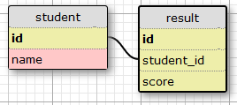

For this challenge you need to create a simple SELECT statement. Your task is to calculate the MIN, MEDIAN and MAX scores of the students from the results table.

### Tables and relationship below:

### Resultant table:
- min
- median
- max

---

- SQL
- Statistics
- Fundamentals
